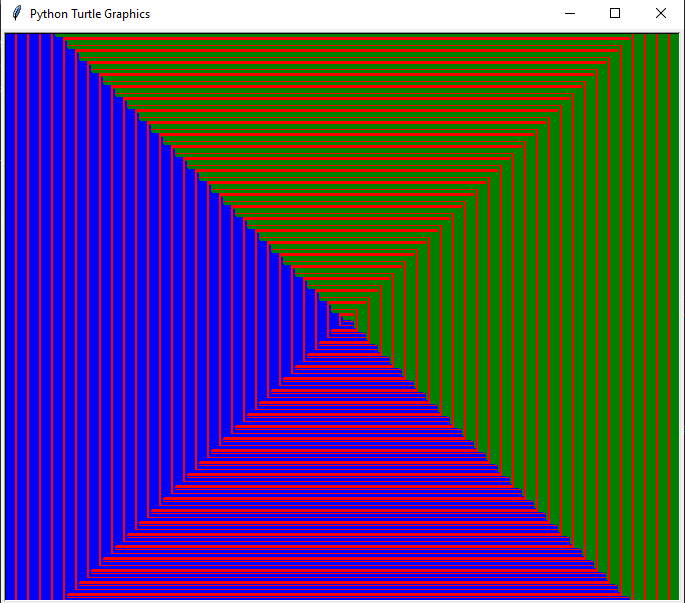

# Shapes in Turtle for Python

Hello everyone, this is a library for generating shapes in turtle with python. This library was generated by [Github Copilot AI](https://github.com/features/copilot).

There is no pypi package for this library. You can install it by running the following command:

```
pip install git+https://github.com/Moondark876/Shapes-in-Turtle
```
    
Then you can import the library by running the following command:
    
```python
import shapes
```

Here is a sample script using the library:

```python
import shapes

shaper = shapes.Shape(10, 10, "brown")
for i in range(1000):
    if i % 2 == 0:
        shaper.set_x(-i)
        if i % 4 == 0:
            shaper.set_y(i)
            shaper.set_color("green")
        else: 
            shaper.set_y(-i)
            shaper.set_color("red")
    else:
        shaper.set_x(i)
        if i % 3 == 0:
            shaper.set_y(i)
            shaper.set_color("red")
        else:
            shaper.set_y(-i)
            shaper.set_color("blue")
```

The above script produces this shape:

